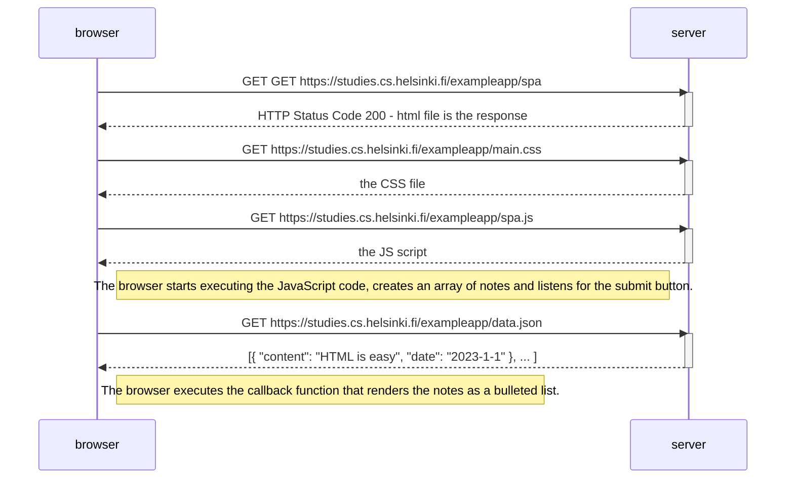

```mermaid
sequenceDiagram
participant browser
participant server

    browser->>server: GET GET https://studies.cs.helsinki.fi/exampleapp/spa
    activate server
    server-->>browser: HTTP Status Code 200 - html file is the response
    deactivate server

    browser->>server: GET https://studies.cs.helsinki.fi/exampleapp/main.css
    activate server
    server-->>browser: the CSS file
    deactivate server

    browser->>server: GET https://studies.cs.helsinki.fi/exampleapp/spa.js
    activate server
    server-->>browser: the JS script
    deactivate server

    Note right of browser: The browser starts executing the JavaScript code, creates an array of notes and listens for the submit button.

    browser->>server: GET https://studies.cs.helsinki.fi/exampleapp/data.json
    activate server
    server-->>browser: [{ "content": "HTML is easy", "date": "2023-1-1" }, ... ]
    deactivate server

    Note right of browser: The browser executes the callback function that renders the notes as a bulleted list.
```
