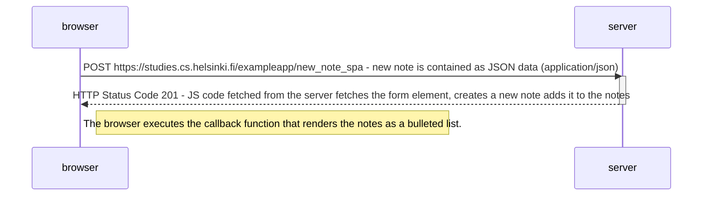

```mermaid
sequenceDiagram
participant browser
participant server

    browser->>server: POST https://studies.cs.helsinki.fi/exampleapp/new_note_spa - new note is contained as JSON data (application/json)
    activate server
    server-->>browser: HTTP Status Code 201 - JS code fetched from the server fetches the form element, creates a new note adds it to the notes
    deactivate server

    Note right of browser: The browser executes the callback function that renders the notes as a bulleted list.
```
